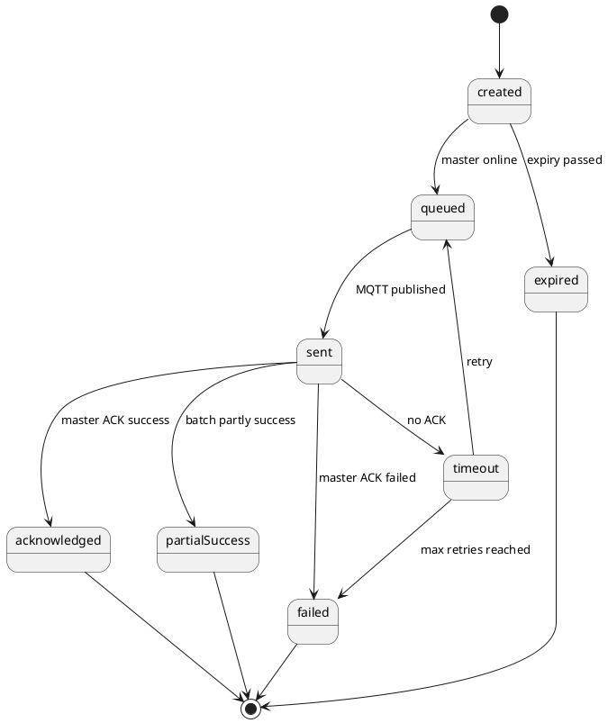

# Drip Irrigation SaaS Workflows

## 1. Farmer onboarding

```text
Distributor/Admin creates farmer
        ↓
Farmer profile is linked to user account
        ↓
Farmer buys devices
        ↓
Field is created
        ↓
Master controller is assigned to field
        ↓
Zones are created
        ↓
Valves are added under zones
```

## 2. Farm hierarchy

```text
Farmer
 └── Field
      ├── Master Controller
      └── Zone
           └── Valve
```

Rules:

- One farmer can have many fields.
- One field has exactly one master controller.
- One field can have many zones.
- One zone can have many valves.
- One valve belongs to exactly one zone.
- The master controller controls only the valves inside its field.

## 3. Manual valve command workflow

```text
Farmer taps "Open Valve"
        ↓
API validates farmer owns the valve
        ↓
API finds valve → zone → field → masterController
        ↓
API creates command
        ↓
API creates one commandItem
        ↓
If master is online, command is queued
        ↓
Worker publishes MQTT command
        ↓
Master controller opens valve
        ↓
Master sends ACK
        ↓
API updates command status to acknowledged
        ↓
API updates valve status to open
        ↓
Socket.IO event updates app
```

## 4. Zone command workflow

A zone command is represented as one parent command with many commandItems.

```text
Farmer taps "Open Zone"
        ↓
API validates zone ownership
        ↓
API loads all active valves in the zone
        ↓
API creates command targetType=zone
        ↓
API creates commandItems ordered by valveNumber
        ↓
Worker publishes batch command to master
        ↓
Master executes valves sequentially
        ↓
Master waits ZONE_VALVE_DELAY_SECONDS between each valve
        ↓
Master sends batch ACK
        ↓
API updates all commandItems and valve statuses
```

## 5. Offline master workflow

```text
Master misses heartbeat for HEARTBEAT_OFFLINE_THRESHOLD_SECONDS
        ↓
System marks master offline
        ↓
New commands stay created until master comes online
        ↓
Manual commands expire after MANUAL_COMMAND_EXPIRY_MINUTES
        ↓
When heartbeat arrives, master becomes online
        ↓
API queues non-expired created commands
```

## 6. Command idempotency

Every command has a globally unique `commandUid`.

The master controller must store recently processed command UIDs. If it receives a duplicate command UID, it must return the old ACK and must not execute the hardware operation again.

## 7. Command state machine



## 8. Master heartbeat payload

Topic:

```text
farm/{farmerId}/field/{fieldId}/master/{deviceUid}/heartbeat
```

Payload:

```json
{
  "firmwareVersion": "1.0.0",
  "signalStrength": 76,
  "batteryVoltage": 12.4,
  "powerSource": "solar"
}
```

## 9. Master ACK payload

Topic:

```text
farm/{farmerId}/field/{fieldId}/master/{deviceUid}/ack
```

Payload:

```json
{
  "commandUid": "cmd_xxx",
  "status": "acknowledged",
  "items": [
    {
      "valveId": "1",
      "status": "acknowledged",
      "currentValveStatus": "open"
    }
  ]
}
```

## 10. Commercial workflow

```text
Farmer buys devices
        ↓
Order has device line items
        ↓
Platform/service fee can be added as platformFee or serviceFee product
        ↓
Farmer service plan can be bundled with purchase
        ↓
Monitoring/support is controlled by farmerServicePlans
```
